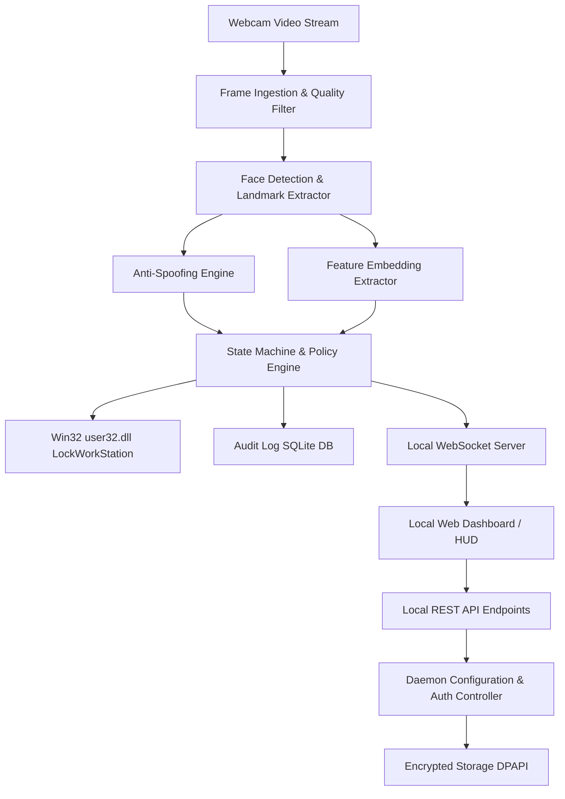
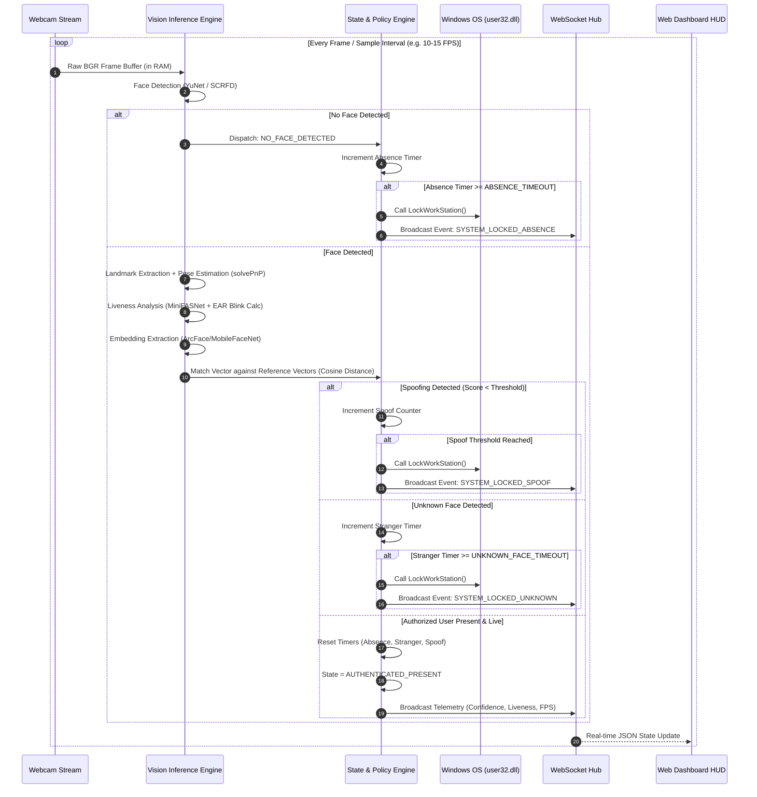

# FaceSentry System Architecture Specification
**Document Version:** 1.0.0  
**Target Platform:** Windows 10 / Windows 11 (x64)  
**Security & Privacy Baseline:** Zero-Cloud, 100% On-Device Processing, DPAPI-Encrypted Storage  

---

## 1. System Overview

FaceSentry is an autonomous, privacy-first, on-device biometric security system engineered for Windows workstations. It continuously monitors user presence via the local webcam, performs high-speed local face recognition and multi-layer anti-spoofing liveness verification, and automatically enforces Windows workstation lock policies when the authorized user departs, an unknown individual is detected, or spoofing attacks are intercepted.

```
 +-----------------------------------------------------------------------------------+
 |                                   FACESENTRY                                      |
 |                                                                                   |
 |  +-----------------------+     +-----------------------+     +------------------+  |
 |  |    Webcam Pipeline    | --> |  Inference & Liveness | --> |  State & Policy  |  |
 |  | DirectShow / MediaFnd |     |  ONNX / DirectML / CPU|     |   Engine (SM)    |  |
 |  +-----------------------+     +-----------------------+     +--------+---------+  |
 |                                                                       |            |
 |                                        +------------------------------+            |
 |                                        |                                           |
 |                                        v                                           |
 |  +-------------------+      +--------------------+      +-----------------------+  |
 |  | Windows API Lock  | <--- |  Core Daemon Engine | ---> | Local API & WebSocket |  |
 |  | LockWorkStation() |      | (Tray / Win32 App) |      | (FastAPI @ 127.0.0.1) |  |
 |  +-------------------+      +---------+----------+      +-----------+-----------+  |
 |                                       |                             |              |
 |                                       v                             v              |
 |                             +--------------------+      +-----------------------+  |
 |                             | Encrypted Storage  |      |   Local Web HUD / UI  |  |
 |                             | SQLite + Win DPAPI |      |  (Vite / React / CSS) |  |
 |                             +--------------------+      +-----------------------+  |
 +-----------------------------------------------------------------------------------+
```

### Core Tenets
1. **Strict Data Sovereignty (Zero Cloud):** Biometric embeddings, verification events, settings, and facial crops never leave the local machine. Network listening is strictly bound to `127.0.0.1`.
2. **Deterministic Locking:** Sub-second response upon trigger conditions (absence, stranger presence, spoofing) using native Win32 `user32.dll!LockWorkStation`.
3. **Multi-Layered Anti-Spoofing:** Simultaneous execution of passive deep learning anti-spoofing (MiniFASNet / Silent-Face), continuous biological micro-action analysis (Eye Aspect Ratio blink detection), and 3D head pose estimation.
4. **Resilient Session Awareness:** Integration with Windows Session Notification events (`WTSRegisterSessionNotification`) and power management to suspend camera capture while the workstation is locked or sleeping.

---

## 2. Component Responsibilities



### 2.1 Component Breakdown

| Component | Technology Stack | Core Responsibility |
| :--- | :--- | :--- |
| **Windows Agent Daemon** | Python 3.10+ / Win32 APIs / `pystray` / `asyncio` | Runs background tray process, monitors Windows session lock/unlock/sleep events, manages camera lifecycle, coordinates state machine, executes `LockWorkStation()`. |
| **Vision & Inference Engine** | OpenCV, ONNX Runtime (DirectML / CPU), MediaPipe / YuNet, MiniFASNet | Captures frames, extracts 5-point/68-point landmarks, computes Eye Aspect Ratio (EAR), predicts liveness score, generates 128-D SFace embeddings. |
| **State & Policy Engine** | Pure State Machine (`transitions` / async event-loop) | Evaluates continuous frame results against timing windows (`ABSENCE_TIMEOUT`, `UNKNOWN_FACE_TIMEOUT`, `SPOOF_LOCK_TIMEOUT`) and dispatches lock actions. |
| **Local API & WebSocket Server** | FastAPI, Uvicorn (bound to `127.0.0.1`) | Serves authenticated REST endpoints for configuration, enrollment, and log inspection; streams real-time telemetry over WebSockets. |
| **Local Web Dashboard (HUD)** | Modern Responsive Web App (Vite, React / Vanilla JS, Glassmorphic CSS) | Provides enrollment wizard, real-time live telemetry HUD, face mesh preview, PIN setup/fallback, log viewer, and policy customization. |
| **Secure Local Data Store** | SQLite3 (WAL mode) + Windows DPAPI (`CryptProtectData`) | Stores encrypted reference face embeddings, Argon2id-hashed PINs, audit logs, and system preferences. |

---

## 3. Data Flow Architecture

### 3.1 Live Monitoring Loop (Active Duty Flow)



### 3.2 User Enrollment Data Flow
1. User enters Dashboard and initiates Enrollment Mode.
2. User authenticates with Local Master PIN (or sets up initial PIN).
3. Vision engine guides user through multi-angle capture (Frontal, Pitch Up/Down, Yaw Left/Right).
4. Frame quality gate validates:
   - Illumination ($I_{mean} \in [40, 220]$)
   - Sharpness / Blur score (Laplacian variance $> 100$)
   - Landmark alignment confidence $> 95\%$
5. Engine calculates 128-D normalized embedding vectors for each valid sample.
6. Vectors are aggregated into a user profile template.
7. Profile vector is encrypted using Windows Data Protection API (DPAPI) and written to the local SQLite database.
8. Raw enrollment image frames are purged immediately from memory.

---

## 4. Security Model

### 4.1 Process Isolation & Privilege Architecture
- **Interactive User Session Execution:** The Windows Agent Daemon runs in the interactive user session (Session 1+) under standard user permissions. This ensures direct access to:
  - Video capture devices without service isolation sandboxing.
  - `user32.dll!LockWorkStation` which immediately locks the current interactive desktop.
  - User-specific DPAPI cryptographic master keys.
- **Single Instance Lock:** Mutex synchronization (`CreateMutexW(NULL, TRUE, "Global\\FaceSentry_Agent_SingleInstance")`) prevents duplicate daemon instances.

### 4.2 Local API Security & Authentication
- **Localhost Only:** HTTP and WebSocket listeners bind exclusively to `127.0.0.1` (never `0.0.0.0`).
- **Session Token Authorization:** On startup, the daemon generates a cryptographically secure 256-bit entropy token saved to `%LOCALAPPDATA%\FaceSentry\session.token` with strict ACLs (owner read-only).
- **Bearer Token Verification:** All REST endpoints and WebSocket connections require `Authorization: Bearer <token>`.
- **CORS & Origin Hardening:** Restricted to `http://127.0.0.1:<PORT>` and `http://localhost:<PORT>`.

### 4.3 Fallback PIN Security
- **Hashing:** Master PIN is hashed using `Argon2id` (Memory: 64MB, Iterations: 3, Parallelism: 4) with a unique cryptographically random 16-byte salt.
- **Brute Force Protection:**
  - 3 failed attempts: 30-second backoff.
  - 5 failed attempts: 5-minute backoff + immediate system lock.
  - 10 failed attempts: Biometric profile lockout (requires Windows password re-authentication).

### 4.4 Threat Matrix & Mitigations

| Threat Vector | Severity | Mitigation Strategy |
| :--- | :--- | :--- |
| **Printed Photo / Poster Spoof** | High | Deep learning texture anti-spoofing (MiniFASNet) + EAR blink detection requirement. |
| **Video Replay on Screen/Tablet** | High | Moire pattern detection, specular reflection analysis, and 3D head pose angular variation tracking. |
| **Physical Theft of Database** | Critical | Biometric embeddings encrypted with Windows DPAPI (tied to Windows user account credentials). Raw images never saved. |
| **Unauthorized Local REST Call** | Medium | Ephemeral session token with local user ACLs + strict localhost binding. |
| **Camera Tampering / Cover** | High | Black frame / zero-variance detection triggers immediate absence countdown. |
| **Shoulder Surfing / Multi-Face** | Medium | Multi-face detection policy: triggers lock or privacy alert when an unknown face appears behind user. |

---

## 5. Privacy Model

```
+-------------------------------------------------------------------------+
|                        ZERO-CLOUD PRIVACY BOUNDARY                      |
|                                                                         |
|  [ Webcam ] ---> [ RAM Buffer ] ---> [ Embedding (128 floats) ]         |
|                         |                          |                    |
|                         v                          v                    |
|                 (Frame Discarded)         [ DPAPI Encryption ]          |
|                                                    |                    |
|                                                    v                    |
|                                           [ Local SQLite DB ]           |
|                                                                         |
|  =====================================================================  |
|  NO Cloud Telemetry | NO External Requests | NO Raw Image Disk Storage  |
+-------------------------------------------------------------------------+
```

1. **Non-Invertible Mathematical Templates:** Facial data is stored strictly as 128-dimensional unit vectors (floating-point representations). It is mathematically intractable to reconstruct high-fidelity facial photography from these embeddings.
2. **Ephemeral RAM Pipeline:** Camera frames reside exclusively in volatile memory buffers and are overwritten upon the subsequent frame acquisition.
3. **No External Network Dependencies:** Zero cloud APIs, telemetry collectors, crash-reporting SDKs, or external font/asset CDNs. All frontend assets are bundled locally.
4. **Privacy HUD Masking:** Live camera previews within the dashboard can be masked with an abstract wireframe landmark mesh, preventing shoulder surfers from observing the user's room surroundings.

---

## 6. Frontend Architecture (Local Web HUD)

### 6.1 Design Principles
- **Aesthetic:** Cyberpunk/Glassmorphic dark UI with refined typography, fluid micro-animations, and instant state responsiveness.
- **Latency:** Real-time canvas overlay rendering ($<16\text{ms}$ render loop for landmark tracking).
- **Zero Framework Bloat Option:** Built with modern Vite + React / Vanilla JS componentry.

### 6.2 Component Hierarchy
```
AppRoot
├── NavigationBar (System Status, Quick Lock, Snooze Button, Settings)
├── LiveHUDView
│   ├── CameraStreamCanvas (Video Frame + Bounding Box + Landmark Mesh Overlay)
│   ├── BiometricTelemetryPanel (Confidence %, Liveness Score, FPS, Match Distance)
│   └── StateStatusIndicator (Present / Absent / Stranger / Locked)
├── EnrollmentWizardModal
│   ├── StepGuide (Front, Left, Right, Up, Down)
│   ├── RealTimeQualityGauge (Lighting, Blur, Alignment)
│   └── ProfileNameInput
├── SecurityLogViewer
│   ├── FilterBar (Event Type, Date Range)
│   ├── EventLogTable (Timestamp, Event, Confidence, Action Taken)
│   └── ExportAuditLogButton (Encrypted JSON / CSV)
├── PolicyConfigView
│   ├── TimeoutSliders (Absence: 1-60s, Unknown: 1-30s, Spoof: 0-10s)
│   ├── SensitivitySliders (Similarity Threshold, Liveness Cutoff)
│   ├── HardwareSelector (Camera Index, Resolution, FPS)
│   └── MultiFaceActionSelector (Ignore / Warn / Lock)
└── PinFallbackModal (Master PIN entry, Rate-limit countdown)
```

---

## 7. API Architecture

All endpoints reside under `/api/v1` and require the `Authorization: Bearer <TOKEN>` header.

### 7.1 REST Endpoints

```
GET    /api/v1/health                  -> Healthcheck & daemon uptime
GET    /api/v1/status                  -> Current engine state, active profile, telemetry
POST   /api/v1/auth/pin/verify         -> Verify master PIN
POST   /api/v1/auth/pin/set            -> Initialize or change master PIN
POST   /api/v1/enroll/start            -> Enter enrollment mode
POST   /api/v1/enroll/capture          -> Submit enrollment sample frame
POST   /api/v1/enroll/finalize         -> Complete enrollment & save template
DELETE /api/v1/enroll                  -> Delete existing biometric profile
GET    /api/v1/config                  -> Fetch current policy & hardware configuration
PATCH  /api/v1/config                  -> Update policy (timeouts, thresholds, camera)
GET    /api/v1/logs                    -> Query paginated security audit history
DELETE /api/v1/logs                    -> Clear audit logs (requires PIN)
POST   /api/v1/system/lock             -> Immediately trigger Windows lock
POST   /api/v1/system/snooze           -> Temporarily pause monitoring for N seconds
POST   /api/v1/system/resume           -> Resume active monitoring
```

### 7.2 WebSocket Telemetry Protocol (`/ws/telemetry`)
Real-time continuous broadcast at $10-20\text{Hz}$:

```json
{
  "timestamp": 1771630220.451,
  "state": "AUTHENTICATED_PRESENT",
  "face_detected": true,
  "bounding_box": {"x": 180, "y": 120, "w": 280, "h": 280},
  "landmarks": [[240, 200], [320, 200], [280, 250], [250, 310], [310, 310]],
  "metrics": {
    "similarity_score": 0.884,
    "liveness_score": 0.942,
    "eye_aspect_ratio": 0.285,
    "head_pose": {"pitch": -2.1, "yaw": 4.5, "roll": 0.8},
    "inference_latency_ms": 28.4,
    "fps": 18.2
  },
  "timers": {
    "absence_elapsed_s": 0.0,
    "unknown_elapsed_s": 0.0,
    "spoof_elapsed_s": 0.0
  }
}
```

---

## 8. Windows Agent Architecture

### 8.1 Process Structure & Win32 Interop
- **`facesentry_agent.py`:** Main supervisor process.
- **Session Notification Listener:** Uses `wtsapi32.dll` (`WTSRegisterSessionNotification(hWnd, NOTIFY_FOR_THIS_SESSION)`) to receive `WM_WTSSESSION_CHANGE` messages:
  - `WTS_SESSION_LOCK`: Pause camera capture and inference loop to preserve hardware and release camera device.
  - `WTS_SESSION_UNLOCK`: Re-initialize camera capture and enter active verification state.
- **Power Management Listener:** Hooks `WM_POWERBROADCAST` to handle `PBT_APMSUSPEND` (sleep) and `PBT_APMRESUMEAUTOMATIC` (wake).
- **Lock Invocation:** Direct ctypes binding:
  ```python
  import ctypes
  user32 = ctypes.windll.user32
  user32.LockWorkStation()
  ```

### 8.2 System Tray Controller (`pystray`)
- Provides resident background tray icon with menu items:
  - **Open Dashboard** (Launches default browser to `http://127.0.0.1:8765/?token=...`)
  - **Status:** Present / Snoozed / Locked
  - **Snooze Monitoring** (5m, 15m, 1h)
  - **Lock Now**
  - **Exit FaceSentry** (Protected by Master PIN)

---

## 9. Face Recognition Architecture

```
+------------------------------------------------------------------------------------+
|                           FACE RECOGNITION PIPELINE                                |
|                                                                                    |
|  [ Raw Frame ]                                                                     |
|       |                                                                            |
|       v                                                                            |
|  [ Face Detector: YuNet / SCRFD ] ---> Bounding Box (x,y,w,h) + 5 Key Landmarks   |
|       |                                                                            |
|       v                                                                            |
|  [ Affine Transform / Alignment ] ---> Standardized 112x112 RGB Normalized Crop    |
|       |                                                                            |
|       v                                                                            |
|  [ SFace ONNX ]                   ---> 128-Dimensional Feature Vector (Normalized) |
|       |                                                                            |
|       v                                                                            |
|  [ Cosine Similarity Matcher ]    ---> Score S = (U . V) / (||U|| * ||V||)         |
|       |                                                                            |
|       +---> S >= Threshold (e.g. 0.65) -> AUTHORIZED USER                          |
|       +---> S <  Threshold             -> UNKNOWN / STRANGER                       |
+------------------------------------------------------------------------------------+
```

### 9.1 Multi-Template Enrollment Model
To accommodate glasses, varying hairstyles, and lighting discrepancies:
- System stores up to $N = 5$ reference vectors per user ($\mathbf{V}_1, \mathbf{V}_2, \ldots, \mathbf{V}_5$).
- Match score is computed as:
  $$S_{match} = \max_{i \in [1, N]} \left( \frac{\mathbf{u} \cdot \mathbf{V}_i}{\|\mathbf{u}\| \|\mathbf{V}_i\|} \right)$$
- Calibration baseline: $S_{match} \ge 0.65$ corresponds to a False Acceptance Rate (FAR) $< 0.001\%$.

---

## 10. Liveness Architecture (Anti-Spoofing)

FaceSentry enforces a 3-tier defense in depth against presentation attacks:

```
                          Incoming Face Crop
                                  |
            +---------------------+---------------------+
            |                     |                     |
            v                     v                     v
     [ Tier 1: Deep ]      [ Tier 2: Bio ]       [ Tier 3: 3D ]
    MiniFASNetV2 Anti-      Eye Aspect Ratio     Head Pose PnP
    Spoofing Model (ONNX)   Blink Analysis       3D Translation
            |                     |                     |
     P(Live) >= 0.75         Blink Detected        Natural Micro-
            |               Within Window          Angles Detected
            +---------------------+---------------------+
                                  |
                                  v
                    [ Liveness Synthesis Engine ]
                                  |
                Score = w1*P_live + w2*P_blink + w3*P_pose
                                  |
                      Final Liveness Decision
```

### 10.1 Tier 1: Passive Deep Learning Anti-Spoofing
- **Model:** MiniFASNetV2 / Silent-Face-Anti-Spoofing ONNX.
- **Inputs:** Expanded 80x80 / 128x128 face crops with context background.
- **Analysis:** High-frequency Fourier spectrum, Moire fringe patterns, chromatic aberration, and screen glare reflection.

### 10.2 Tier 2: Biological Eye Aspect Ratio (EAR) Blink Detection
- Uses 6-point ocular landmark tracking for left and right eyes:
  $$EAR = \frac{\|p_2 - p_6\| + \|p_3 - p_5\|}{2 \|p_1 - p_4\|}$$
- A blink is registered when $EAR < 0.20$ for $2-4$ consecutive frames followed by reopening.
- Policy requires periodic blinks; absence of any blink for $> 25\text{s}$ triggers an active challenge or liveness penalty.

### 10.3 Tier 3: 3D Head Pose & Micro-Movement
- Solves Perspective-n-Point (`cv2.solvePnP`) using 6 canonical 3D facial coordinate landmarks (Nose tip, Chin, Left/Right Eye corners, Left/Right Mouth corners).
- Evaluates Pitch ($\theta$), Yaw ($\psi$), and Roll ($\phi$) variance. Flat 2D photographs yield zero 3D rotation variance under perspective shifts.

---

## 11. Event Model & Audit Trail

### 11.1 Event Schema (SQLite Database)
```sql
CREATE TABLE IF NOT EXISTS security_events (
    id INTEGER PRIMARY KEY AUTOINCREMENT,
    timestamp DATETIME DEFAULT CURRENT_TIMESTAMP,
    event_type TEXT NOT NULL,
    confidence REAL,
    liveness_score REAL,
    action_taken TEXT NOT NULL,
    metadata_json TEXT
);

CREATE INDEX idx_events_timestamp ON security_events(timestamp);
CREATE INDEX idx_events_type ON security_events(event_type);
```

### 11.2 Event Catalog

| Event Code | Trigger Condition | Default Action |
| :--- | :--- | :--- |
| `USER_AUTHENTICATED` | User face verified with valid liveness | Maintain unlocked session |
| `USER_ABSENT` | No face detected in frame | Start absence timer |
| `UNKNOWN_FACE_DETECTED` | Face detected but embedding similarity $< 0.65$ | Start stranger timer |
| `SPOOF_ATTEMPT_DETECTED` | Liveness score below cutoff | Increment spoof counter |
| `LOCK_TRIGGERED_ABSENCE` | Absence timer exceeded `ABSENCE_TIMEOUT` | Invoke `LockWorkStation()` |
| `LOCK_TRIGGERED_STRANGER` | Stranger timer exceeded `UNKNOWN_FACE_TIMEOUT` | Invoke `LockWorkStation()` |
| `LOCK_TRIGGERED_SPOOF` | Spoof threshold reached | Invoke `LockWorkStation()` |
| `PIN_VERIFIED_SUCCESS` | Correct PIN entered in HUD | Unlock dashboard / modify config |
| `PIN_VERIFIED_FAILURE` | Invalid PIN entered | Increment rate-limit penalty |
| `ENROLLMENT_COMPLETED` | New reference template recorded | Update biometric profile |

---

## 12. Configuration Model

Configurations are validated using Pydantic and persisted in encrypted local configuration files:

```json
{
  "hardware": {
    "camera_index": 0,
    "capture_resolution": [640, 480],
    "target_fps": 15,
    "backend_api": "DirectShow"
  },
  "timeouts": {
    "absence_timeout_seconds": 10,
    "unknown_face_timeout_seconds": 5,
    "spoof_lock_timeout_seconds": 0,
    "snooze_max_duration_minutes": 60
  },
  "thresholds": {
    "similarity_match_threshold": 0.65,
    "liveness_confidence_threshold": 0.75,
    "ear_blink_threshold": 0.20,
    "min_face_size_pixels": 80
  },
  "policies": {
    "lock_on_absence": true,
    "lock_on_unknown_face": true,
    "lock_on_spoof": true,
    "multi_face_mode": "WARN_ON_SECONDARY",
    "require_periodic_blink": true
  },
  "security": {
    "pin_lockout_attempts": 5,
    "pin_lockout_duration_seconds": 300,
    "dpapi_encryption_enabled": true
  },
  "server": {
    "host": "127.0.0.1",
    "port": 8765,
    "enable_ws_stream": true
  }
}
```

---

## 13. Failure Handling & Edge Cases

1. **Webcam Disconnection / Hardware Failure:**
   - Detect frame grab failure (`cap.read() == False`).
   - Initiate 5-second graceful hardware reconnect attempt.
   - If device fails to re-initialize, trigger fallback workstation lock and write error event.
2. **Extreme Low Light / Darkness:**
   - Calculate frame mean pixel luminance.
   - If mean luminance $< 20/255$, issue `LOW_LIGHT_WARNING` on HUD telemetry.
   - Prevent false stranger lockouts by extending absence grace period with notification sound.
3. **Partial Facial Occlusion (Face Mask, Hands):**
   - Landmark confidence scores drop on occluded points.
   - State machine maintains grace period without locking immediately if upper facial landmarks (eyes/forehead) retain high match confidence.
4. **Daemon Crash Resilience:**
   - Dual-process supervisor / Windows Scheduled Task auto-restart.
   - If watchdog detects unexpected daemon termination, it issues a protective workstation lock.

---

## 14. Testing Strategy

```
+--------------------------------------------------------------------+
|                         TESTING PYRAMID                            |
|                                                                    |
|                      [ End-to-End HUD Tests ]                      |
|                (Playwright / Cypress Web Dashboard)                |
|                                                                    |
|                 [ System & Video Replay Tests ]                    |
|             (Simulated Video Ingestion: Spoof vs Real)             |
|                                                                    |
|             [ Integration Tests: API & State Machine ]             |
|            (FastAPI TestClient, SQLite DB, Transitions)            |
|                                                                    |
|               [ Unit Tests: Core Algorithms ]                      |
|         (Vector Cosine Math, EAR Calculation, DPAPI, Hash)         |
+--------------------------------------------------------------------+
```

### 14.1 Synthetic Test Fixtures
- **`tests/fixtures/synthetic_faces/`:** Pre-recorded synthetic video clips representing:
  - Valid user presence under varying lighting.
  - Photo print attack.
  - Video screen playback attack.
  - Sudden user departure (absence).
  - Unregistered person entering frame.

---

## 15. Deployment Strategy (Windows)

### 15.1 Packaging Pipeline
- **Daemon Packaging:** PyInstaller / Nuitka compiles the Python runtime, OpenCV, ONNX Runtime, and DirectML binaries into a single directory package (`dist/facesentry-daemon/`).
- **Frontend Packaging:** Vite builds minified static assets (`dist/web/`) embedded directly into the daemon's static file server.
- **Installer Creation:** Inno Setup generates a clean Windows installer (`FaceSentry_Setup.exe`):
  - Installs to `%LOCALAPPDATA%\Programs\FaceSentry`.
  - Configures user startup registry key (`HKCU\Software\Microsoft\Windows\CurrentVersion\Run`).
  - Registers Windows Firewall rule for local loopback (if required).
  - Creates uninstaller that safely purges or retains local DPAPI data based on user selection.

---

## 16. Proposed Repository Directory Structure

```
FaceSentry/
├── docs/
│   ├── ARCHITECTURE.md                  # This document
│   └── API_SPEC.md                      # Detailed API OpenAPI/Swagger spec
├── src/
│   ├── daemon/                          # Windows Agent & Daemon
│   │   ├── __init__.py
│   │   ├── main.py                      # Daemon entrypoint & tray supervisor
│   │   ├── config.py                    # Pydantic configuration schemas
│   │   ├── constants.py                 # System defaults & status enums
│   │   ├── win32_interop.py             # user32.dll lock, WTS session listeners
│   │   └── tray.py                      # Pystray system tray management
│   │
│   ├── vision/                          # Computer Vision & Inference Pipeline
│   │   ├── __init__.py
│   │   ├── camera.py                    # OpenCV DirectShow video capture
│   │   ├── detector.py                  # Face detection (YuNet / SCRFD)
│   │   ├── recognizer.py                # Feature embedding extractor (ArcFace)
│   │   ├── liveness.py                  # MiniFASNet anti-spoofing engine
│   │   ├── landmarks.py                 # 68-point mesh & EAR calculator
│   │   └── models/                      # Lightweight ONNX model weights
│   │       ├── face_detection_yunet.onnx
│   │       ├── face_recognition_arcface.onnx
│   │       └── anti_spoof_minifasnet.onnx
│   │
│   ├── core/                            # State Machine & Policy Controller
│   │   ├── __init__.py
│   │   ├── state_machine.py             # Presence state transition engine
│   │   ├── policy.py                    # Timeout & threshold evaluation rules
│   │   └── enrollment.py                # Multi-angle enrollment manager
│   │
│   ├── storage/                         # Database & Encryption Layer
│   │   ├── __init__.py
│   │   ├── database.py                  # SQLite WAL connection & migrations
│   │   ├── crypto_dpapi.py              # Windows DPAPI CryptProtectData wrapper
│   │   ├── pin_auth.py                  # Argon2id PIN hasher & rate limiter
│   │   └── event_logger.py              # Security audit trail logging
│   │
│   ├── api/                             # FastAPI Backend & WebSockets
│   │   ├── __init__.py
│   │   ├── server.py                    # FastAPI app initialization
│   │   ├── auth.py                      # Local token bearer security
│   │   ├── routes/                      # REST endpoint routers
│   │   │   ├── auth_routes.py
│   │   │   ├── config_routes.py
│   │   │   ├── enroll_routes.py
│   │   │   ├── log_routes.py
│   │   │   └── system_routes.py
│   │   └── websocket.py                 # Real-time telemetry broadcast hub
│   │
│   └── frontend/                        # Web Dashboard (Vite / Modern UI)
│       ├── package.json
│       ├── vite.config.js
│       ├── index.html
│       └── src/
│           ├── index.css                # Glassmorphic dark design system
│           ├── main.jsx                 # UI entrypoint
│           ├── components/              # Modular UI components
│           │   ├── LiveHUD.jsx          # Real-time camera canvas & mesh
│           │   ├── TelemetryPanel.jsx   # Liveness & confidence metrics
│           │   ├── EnrollmentModal.jsx  # Multi-step facial enrollment
│           │   ├── SecurityLogs.jsx     # Event log viewer & search
│           │   ├── SettingsForm.jsx     # Policy & timeout controls
│           │   └── PinDialog.jsx        # Master PIN fallback modal
│           └── services/                # API & WebSocket client hooks
│
├── tests/                               # Comprehensive Automated Test Suite
│   ├── unit/
│   │   ├── test_crypto_dpapi.py
│   │   ├── test_state_machine.py
│   │   ├── test_pin_auth.py
│   │   └── test_liveness_math.py
│   ├── integration/
│   │   ├── test_api_routes.py
│   │   └── test_websocket_telemetry.py
│   └── fixtures/
│       └── mock_frames.py
│
├── scripts/                             # Packaging & Utility Scripts
│   ├── build_installer.py
│   ├── download_models.py
│   └── setup_dev_env.ps1
│
├── .gitignore
├── requirements.txt                     # Python dependencies
└── README.md
```

---

## 17. Concise Implementation Roadmap

```
PHASE 1: Foundation, Security & Storage
├── 1.1 Local SQLite schema & migration setup
├── 1.2 Windows DPAPI encryption wrapper implementation
├── 1.3 Argon2id PIN authentication & rate-limiting engine
└── 1.4 Secure token generator & storage config

PHASE 2: Vision & Inference Pipeline
├── 2.1 DirectShow camera capture module with auto-reconnect
├── 2.2 Face detection (YuNet) & landmark extraction
├── 2.3 Feature vector embedding extractor (ArcFace ONNX)
├── 2.4 Multi-tier liveness engine (MiniFASNet + EAR Blink + Pose)
└── 2.5 Multi-angle enrollment aggregation logic

PHASE 3: State Machine & Windows Integration
├── 3.1 Core presence state machine & timeout evaluators
├── 3.2 Win32 user32.dll LockWorkStation interop integration
├── 3.3 Windows Session (WTS) & Power suspend/resume event hooks
└── 3.4 Pystray system tray background supervisor

PHASE 4: Local API & Telemetry Engine
├── 4.1 FastAPI server setup bound to 127.0.0.1 with Token Auth
├── 4.2 REST endpoints (Enrollment, Config, Logs, System Controls)
└── 4.3 High-frequency WebSocket telemetry broadcast hub

PHASE 5: Frontend HUD & Dashboard
├── 5.1 Vite + React/Vanilla UI with glassmorphic dark design system
├── 5.2 Real-time Live HUD with camera canvas & landmark mesh overlay
├── 5.3 Interactive enrollment wizard with real-time quality feedback
├── 5.4 Audit log viewer with search/filter & settings configuration
└── 5.5 PIN fallback & session locking controls

PHASE 6: Verification, Hardening & Packaging
├── 6.1 Unit, integration, and mock video test suite execution
├── 6.2 Latency, memory leak, and CPU/DirectML performance benchmarking
├── 6.3 PyInstaller executable compilation
└── 6.4 Inno Setup Windows installer creation (.exe)
```
