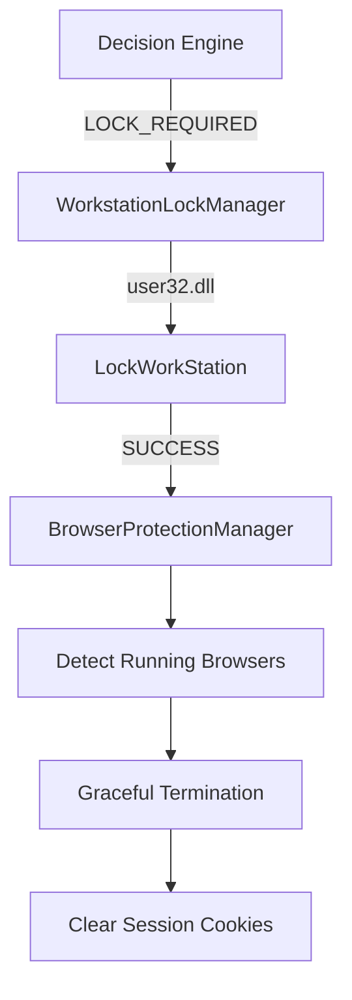

# FaceSentry Safe Browser Protection

FaceSentry includes a Defense-in-Depth browser session protection feature (Phase 9).
This feature mitigates the risk of an adversary resuming authenticated web sessions after a workstation is locked.

## Architecture & Trigger

The `BrowserProtectionManager` is tightly coupled to the Windows Workstation Lock event.
It is invoked exclusively by the `WorkstationLockManager` **after** a successful `LockWorkStation()` API call.

## Modes of Operation

Configurable via `packages/shared/schemas.py -> BrowserProtectionConfigSchema`.

1. **DISABLED (Default)**
   - Browser protection is inactive. No process monitoring or termination occurs.
2. **CLOSE_BROWSER**
   - Detects `chrome.exe`, `msedge.exe`, and `firefox.exe`.
   - Sends a graceful termination signal.
   - Waits up to `close_timeout_seconds` (default: 5s).
3. **CLOSE_BROWSER_AND_CLEAR_SESSION_COOKIES**
   - Performs `CLOSE_BROWSER` action.
   - If processes terminate successfully, modifies the browser's internal SQLite database to clear active session cookies.

## Security Guarantees & Constraints

> [!CAUTION]
> The session cleanup logic is deliberately constrained to avoid destructive data loss.

- **No Password Deletion**: The system will never delete saved passwords or autofill data.
- **No Bookmark Deletion**: The system will never delete bookmarks or history.
- **Strictly Session Cookies**: The SQLite command executed is strictly `DELETE FROM cookies WHERE is_persistent = 0 OR is_persistent = '0'`.

### Browser Specific Support

| Browser | Process | Close Supported | Session Wipe Supported | Reason |
| :--- | :--- | :---: | :---: | :--- |
| **Google Chrome** | `chrome.exe` | ✅ | ✅ | Standard Chromium SQLite DB |
| **Microsoft Edge** | `msedge.exe` | ✅ | ✅ | Standard Chromium SQLite DB |
| **Mozilla Firefox**| `firefox.exe`| ✅ | ❌ | Safe cleanup unsupported due to volatile `cookies.sqlite` schema. Returns `SESSION_CLEANUP_UNSUPPORTED`. |

## Event Telemetry

The following events are emitted for audit trails via the WebSocket telemetry system:
- `BROWSER_PROTECTION_TRIGGERED`
- `BROWSER_DETECTED`
- `BROWSER_CLOSE_REQUESTED`
- `BROWSER_CLOSE_SUCCEEDED` / `BROWSER_CLOSE_FAILED`
- `SESSION_CLEANUP_STARTED`
- `SESSION_CLEANUP_SUCCEEDED` / `SESSION_CLEANUP_FAILED` / `SESSION_CLEANUP_UNSUPPORTED`
